# Hybrid AI Architecture: Platform-Optimized STT + Gemma 3n Integration

**A realistic and efficient approach for real-time spatial captioning**

---

## 🎯 Overview

This document describes a **hybrid AI architecture** that combines the strengths of platform-optimized speech recognition with Gemma 3n's multimodal capabilities to achieve LiveCaptionsXR's vision of spatial, contextual captions. Instead of trying to make Gemma 3n handle real-time audio streams (which it cannot do efficiently), we use a two-stage approach that is both more realistic and more efficient.

## 🏗️ Architecture Design

### **Core Pipeline**

```
🎤 Audio Stream → 📝 Platform STT (Real-time) → 💬 Text Accumulator
                      ↓                              ↓
iOS: Apple Speech Recognition    📸 Periodic Snapshot + 🤖 Gemma 3n → ✨ Enhanced Contextual Caption
Android: Whisper GGML
```

### **Component Breakdown**

1. **Real-time Speech Recognition**: Platform-optimized (Apple Speech on iOS, Whisper GGML on Android)
2. **Text Accumulation**: 3-5 second text buffers
3. **Visual Context**: Periodic camera snapshots
4. **Contextual Enhancement**: Gemma 3n multimodal processing
5. **Spatial Integration**: Existing HybridLocalizationEngine

---

## 🔧 Technical Implementation

### **1. Platform-Optimized STT Implementation**

**iOS: Apple Speech Recognition**
- ✅ **Native iOS integration** with `speech_to_text`
- ✅ **Real-time streaming** capabilities  
- ✅ **On-device processing** (privacy-first)
- ✅ **Excellent accuracy** for English
- ✅ **System-level optimization**
- ✅ **No additional model downloads**

**Android: Whisper GGML**
- ✅ **High-quality transcription** with Whisper models
- ✅ **On-device processing** (141MB model)
- ✅ **Multiple languages** supported
- ✅ **Consistent quality** across devices
- ✅ **Open source** implementation

**Dependencies:**
```yaml
dependencies:
  speech_to_text: ^6.6.0      # iOS Apple Speech
  whisper_ggml: 1.3.0         # Android Whisper
  flutter_gemma: ^0.10.0      # Gemma 3n
```

**Service Implementation:**
```dart
class EnhancedSpeechProcessor {
  final AppleSpeechService _appleSpeechService;
  final WhisperService _whisperService;
  SpeechEngine _activeEngine;
  
  // Platform-specific engine selection
  static SpeechEngine _getDefaultEngine() {
    if (Platform.isIOS) {
      return SpeechEngine.apple_speech;  // iOS: Apple Speech
    } else if (Platform.isAndroid) {
      return SpeechEngine.whisper_ggml;  // Android: Whisper GGML
    }
    return SpeechEngine.flutter_sound;   // Fallback
  }
  
  Future<bool> initialize() async {
    if (_activeEngine == SpeechEngine.apple_speech) {
      return await _appleSpeechService.initialize();
    } else if (_activeEngine == SpeechEngine.whisper_ggml) {
      return await _whisperService.initialize();
    }
    return false;
  }
}
```

### **2. Text Accumulation Strategy**

**Buffer Management:**
- Collect transcription for 3-5 seconds
- Maintain sliding window of recent text
- Trigger Gemma 3n enhancement at regular intervals

```dart
class TextAccumulator {
  final List<TimestampedText> _buffer = [];
  final Duration _windowSize = Duration(seconds: 4);
  
  void addText(String text, DateTime timestamp) {
    _buffer.add(TimestampedText(text, timestamp));
    _cleanOldEntries();
  }
  
  String getAccumulatedText() {
    return _buffer.map((t) => t.text).join(' ');
  }
  
  bool shouldTriggerEnhancement() {
    return _buffer.isNotEmpty && 
           DateTime.now().difference(_buffer.first.timestamp) >= _windowSize;
  }
}
```

### **3. Periodic Visual Context Capture**

**Snapshot Strategy:**
- Capture camera frame every 3-5 seconds
- Only when text accumulation triggers enhancement
- Efficient memory management

```dart
class VisualContextCapture {
  final CameraController _camera;
  
  Future<Uint8List?> captureSnapshot() async {
    try {
      final XFile image = await _camera.takePicture();
      final bytes = await image.readAsBytes();
      
      // Optimize image size for Gemma 3n
      return await _resizeImage(bytes, maxWidth: 512, maxHeight: 512);
    } catch (e) {
      _logger.w('Failed to capture snapshot: $e');
      return null;
    }
  }
}
```

### **4. Gemma 3n Contextual Enhancement**

**Multimodal Processing:**
- Text: Accumulated 3-5 second transcription
- Image: Single camera snapshot
- Context: Spatial information from HybridLocalizationEngine

```dart
class GemmaContextualEnhancer {
  Future<String> enhanceCaption({
    required String accumulatedText,
    Uint8List? visualSnapshot,
    String? spatialDirection,
    String? previousContext,
  }) async {
    final prompt = _buildEnhancementPrompt(
      text: accumulatedText,
      direction: spatialDirection,
      context: previousContext,
    );
    
    if (visualSnapshot != null) {
      // Multimodal enhancement with visual context
      return await _gemmaMultimodal(
        text: prompt,
        image: visualSnapshot,
      );
    } else {
      // Text-only enhancement
      return await _gemmaTextOnly(prompt);
    }
  }
  
  String _buildEnhancementPrompt(/* ... */) {
    return '''
Enhance this live caption for AR display:
Original: "$text"
Speaker direction: $direction
Previous context: $context

Make it spatial and contextual. Example:
"Hello" → "Person to your right said: 'Hello'"

Enhanced caption:''';
  }
}
```

---

## 📊 Data Flow Architecture

### **Complete Processing Pipeline**

```mermaid
graph TD
    A[🎤 Microphone] --> B[StereoAudioCapture]
    B --> C[Vosk STT Service]
    C --> D[Text Accumulator]
    
    E[📹 Camera] --> F[Visual Context Capture]
    
    G[📱 IMU/Sensors] --> H[HybridLocalizationEngine]
    
    D --> I{Buffer Full?}
    I -->|Yes| J[Trigger Enhancement]
    I -->|No| K[Continue Accumulating]
    
    J --> L[Capture Snapshot]
    L --> M[Gemma 3n Enhancement]
    F --> M
    H --> M
    
    M --> N[Enhanced Spatial Caption]
    N --> O[AR Caption Placement]
    
    K --> D
```



### **Timing Diagram**

```
Time:    0s    1s    2s    3s    4s    5s    6s    7s    8s
         |     |     |     |     |     |     |     |     |
Vosk:    "Hi"  "there" "how" "are" "you"  "I'm"  "fine" "thanks"
         |     |     |     |     |     |     |     |     |
Buffer:  [----Accumulate---] → Trigger → [----New Buffer----]
         |     |     |     |     |     |     |     |     |
Gemma:                      📸+🤖 → "Person ahead: 'Hi there how are you'"
         |     |     |     |     |     |     |     |     |
Output:  [----Real-time----] → Enhanced → [----Real-time----]
```

---

## 🚀 Performance Characteristics

### **Latency Profile**

| Component | Latency | Notes |
|-----------|---------|-------|
| Vosk STT | 100-300ms | Real-time preview |
| Text Accumulation | 0ms | Immediate |
| Snapshot Capture | 50-100ms | Periodic only |
| Gemma 3n Enhancement | 500-2000ms | Every 3-5 seconds |
| **Total User Experience** | **100-300ms** | **With enhanced context every few seconds** |

### **Resource Usage**

- **Memory**: ~150MB (Vosk model + Gemma 3n)
- **CPU**: Moderate (mostly during Gemma enhancement)
- **Battery**: Optimized (heavy AI only periodic)
- **Network**: Zero (completely offline)

---

## 🔄 Integration with Existing Architecture

### **Minimal Changes Required**

1. **Replace SpeechProcessor**:
   ```dart
   // Old: Mock-based speech processor
   // New: VoskSTTService + TextAccumulator
   ```

2. **Enhance GemmaASR**:
   ```dart
   // Old: Streaming video processing (impossible)
   // New: Periodic image + text enhancement (realistic)
   ```

3. **Keep Existing Infrastructure**:
   - ✅ HybridLocalizationEngine (unchanged)
   - ✅ AR anchor placement (unchanged)
   - ✅ Flutter BLoC architecture (unchanged)
   - ✅ MethodChannels communication (unchanged)

### **Service Locator Updates**

```dart
void setupServiceLocator() {
  // New services
  sl.registerLazySingleton<VoskSTTService>(() => VoskSTTService());
  sl.registerLazySingleton<TextAccumulator>(() => TextAccumulator());
  sl.registerLazySingleton<VisualContextCapture>(() => VisualContextCapture());
  sl.registerLazySingleton<GemmaContextualEnhancer>(() => GemmaContextualEnhancer());
  
  // Updated speech processor
  sl.registerFactory<SpeechProcessor>(() => HybridSpeechProcessor(
    voskService: sl<VoskSTTService>(),
    textAccumulator: sl<TextAccumulator>(),
    gemmaEnhancer: sl<GemmaContextualEnhancer>(),
    visualCapture: sl<VisualContextCapture>(),
  ));
  
  // Existing services remain unchanged
  sl.registerLazySingleton<HybridLocalizationEngine>(() => HybridLocalizationEngine());
  // ... rest of the services
}
```

---

## 💡 Benefits of This Approach

### **Technical Advantages**

1. **Realistic Implementation**: Uses each AI model for what it does best
2. **Better Performance**: Real-time STT with periodic enhancement
3. **Not Plugin-Blocked**: Uses proven, available technologies
4. **Easier Debugging**: Clear separation of concerns
5. **Scalable**: Can add more enhancement models later

### **User Experience Advantages**

1. **Immediate Feedback**: Users see text appear instantly (Vosk)
2. **Rich Context**: Enhanced captions provide spatial awareness
3. **Reliable**: Less prone to AI model limitations
4. **Privacy-First**: Everything runs on-device
5. **Multilingual**: Both Vosk and Gemma support multiple languages

### **Example Output Progression**

```
Real-time (Vosk):     "hello there"
Enhanced (Gemma 3n):  "Person to your right said: 'Hello there' (waving)"

Real-time (Vosk):     "meeting starts five"
Enhanced (Gemma 3n):  "Colleague at the table said: 'Meeting starts at 5 PM' (pointing at watch)"
```

---

## 🛠️ Implementation Roadmap

### **Phase 1: Core STT (Week 1-2)**
- [ ] Integrate Vosk Flutter plugin
- [ ] Implement VoskSTTService
- [ ] Replace existing mock SpeechProcessor
- [ ] Basic text accumulation

### **Phase 2: Visual Context (Week 3)**
- [ ] Implement VisualContextCapture
- [ ] Periodic snapshot mechanism
- [ ] Image optimization for Gemma 3n

### **Phase 3: Gemma Enhancement (Week 4)**
- [ ] Implement GemmaContextualEnhancer
- [ ] Multimodal prompt engineering
- [ ] Integration with spatial data

### **Phase 4: Integration & Polish (Week 5-6)**
- [ ] Connect all components in HybridSpeechProcessor
- [ ] Performance optimization
- [ ] Error handling and fallbacks
- [ ] Testing and refinement

---

## 🧪 Testing Strategy

### **Component Testing**
- **Vosk STT**: Accuracy benchmarks with known audio
- **Text Accumulation**: Buffer management and timing
- **Gemma Enhancement**: Quality of contextual improvements
- **Visual Context**: Snapshot quality and timing

### **Integration Testing**
- **End-to-End Pipeline**: Full audio → enhanced caption flow
- **Performance Testing**: Resource usage and battery life
- **Error Scenarios**: Network loss, camera failures, etc.

### **User Testing**
- **Accessibility Focus**: Testing with D/HH community
- **Real-world Scenarios**: Meetings, conversations, public spaces
- **Multilingual Testing**: Various language combinations

---

## 📚 Additional Resources

### **Vosk Resources**
- [Vosk Official Documentation](https://alphacephei.com/vosk/)
- [Vosk Flutter Plugin](https://pub.dev/packages/vosk_flutter)
- [Vosk Model Downloads](https://alphacephei.com/vosk/models)

### **Gemma 3n Resources**
- [Gemma Documentation](https://ai.google.dev/gemma)
- [MediaPipe Tasks](https://developers.google.com/mediapipe)
- [Flutter Gemma Plugin](https://pub.dev/packages/flutter_gemma)

---

## 🎯 Conclusion

This hybrid architecture provides a **realistic, efficient, and innovative** approach to spatial captioning. By using Vosk for real-time STT and Gemma 3n for periodic contextual enhancement, we achieve the project's vision while staying within the bounds of what's technically feasible.

The result is a system that provides **immediate feedback** to users while delivering **rich, spatially-aware captions** that transform the accessibility experience.

**Key Takeaway**: Sometimes the best solution isn't trying to make one tool do everything, but rather orchestrating multiple specialized tools to work together harmoniously.
